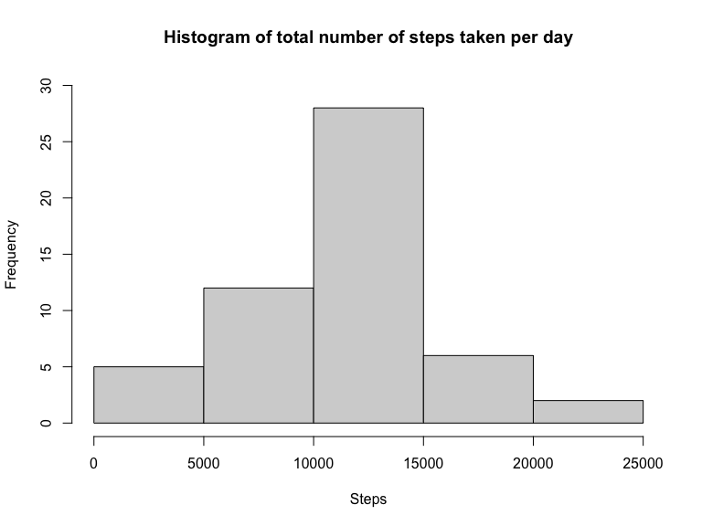
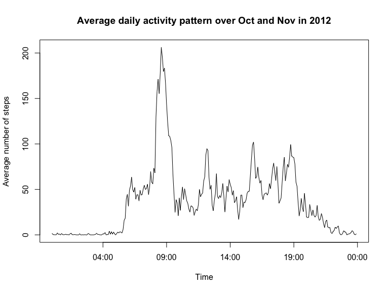
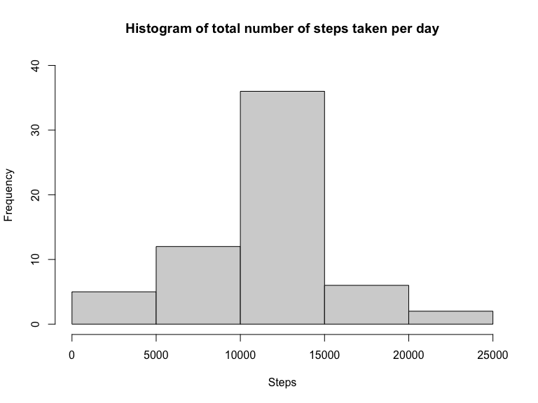
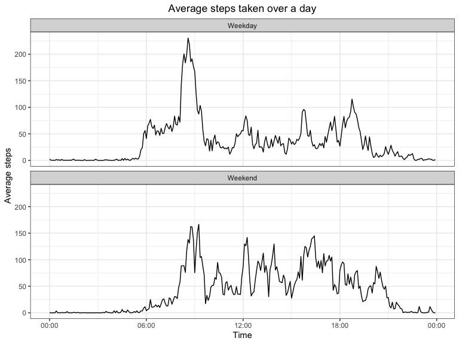

## Loading and preprocessing the data


```r
setwd("~/OneDrive - University College London/R-programming/RepData_PeerAssessment1")
unzip("activity.zip")
activity<-read.csv("activity.csv")
```

## What is mean total number of steps taken per day?

Below is the distribution of total number of steps taken per day during Oct and Nov in 2012.


```r
dailysteps<-with(activity,aggregate(steps,by=list(date),FUN=sum))
hist(dailysteps[,2],main="Histogram of total number of steps taken per day",
     xlab="Steps",ylim=c(0,30))
```

<!-- -->

```r
m<-as.numeric(gsub(".*:","",summary(dailysteps[,2])))
```

The mean total number of steps taken per day is 10766 and median is 10765.

## What is the average daily activity pattern?

Below is the average activity pattern during a day averaged across Oct and Nov in 2012.


```r
library(magrittr)
library(dplyr)
activity$interval<-as.POSIXlt(strptime(sprintf("%04d",activity$interval),"%H%M"),"%H:%M")
stepsByInterval<-activity%>%group_by(interval)%>%summarize(avgSteps=mean(steps,na.rm=TRUE))
plot(stepsByInterval$interval,stepsByInterval$avgSteps,type="l",
     xlab="Time",ylab="Average number of steps",main="Average daily activity pattern over Oct and Nov in 2012")
```

<!-- -->

```r
max<-stepsByInterval[stepsByInterval$avgSteps==max(stepsByInterval$avgSteps),]
```

On average, individuals take most steps (206 steps) at 08:35 of the day.

## Imputing missing values


```r
na<-sum(is.na(activity$steps))
```

There are 2304 missing values in steps.

Missing values are imputed using the mean value for the corresponding 5-minute interval.


```r
activity<-read.csv("activity.csv")
activity$interval<-sprintf("%04d",activity$interval)%>%strptime("%H%M")%>%format("%H:%M")
stepsByInterval<-activity%>%group_by(interval)%>%summarize(avgSteps=mean(steps,na.rm=TRUE))
imputed<-merge(activity,stepsByInterval,by=intersect(names(activity), names(stepsByInterval)))
imputed<-within(imputed, steps[is.na(steps)]<-avgSteps[is.na(steps)])

dailysteps<-with(imputed,aggregate(steps,by=list(date),FUN=sum))
hist(dailysteps[,2],main="Histogram of total number of steps taken per day",
     xlab="Steps",ylim=c(0,40))
```

<!-- -->

```r
imputedsum<-sum(imputed[imputed$date=="2012-10-01","steps"])
```

As missing values come from missingness on eight whole days, imputing missing values with mean value for corresponding 5-minute interval increases the frequency of bind 10000~15000 (total daily steps calculated based on average of 5-minute interval is 10766, which falls into bind 10000~15000).

## Are there differences in activity patterns between weekdays and weekends?


```r
library(lubridate)
library(ggplot2)
imputed$weekday<-weekdays(as.Date(imputed$date))
imputed$weekday<-as.factor(if_else(imputed$weekday %in% c("Monday","Tuesday","Wednesday","Thursday","Friday"), "Weekday", "Weekend"))
imputed<-select(imputed,-avgSteps)
imputed$interval<-as.POSIXct(strptime(imputed$interval,"%H:%M"),"%H:%M")
stepsByInterval<-imputed%>%group_by(weekday,interval)%>%summarize(avgSteps=mean(steps))
ggplot(aes(interval,avgSteps),data=stepsByInterval)+geom_line()+
  scale_x_datetime(date_labels="%H:%M")+
  facet_wrap(~weekday,nrow=2,ncol=1)+
  xlab("Time")+ylab("Average steps")+
  ggtitle("Average steps taken over a day")+
  theme_bw()+
  theme(plot.title = element_text(hjust = 0.5))
```

<!-- -->

As shown in the figure, during weekday, people walk more often around 9:00 am and 19:00 pm, which corresponds to time to work and off work. During weekend, people's walk spread out the day from 9:00 am to 19:00.
